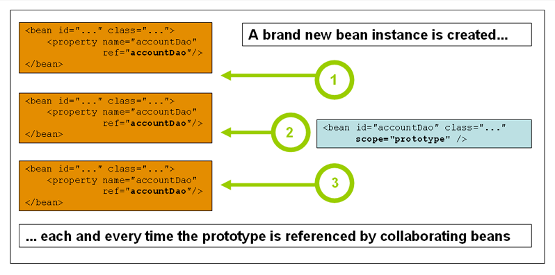

{
    page: 14,
    from: "https://docs.spring.io/spring-framework/reference/core/beans/factory-scopes.html",
    update: "2026-03-16",
    by: ["Arthur Leroux"],
}

# _**Portée des Beans**_

Quand vous créez la définition d'un **bean**, vous créez une recette pour créer des instances réelles de la **class** définie par la définition du **bean**. L'idée que la définition d'un **bean** est une recette est importante, parce que cela signifie que, comme avec une **class**, vous pouvez créer beaucoup d'instances d'objets depuis une seule recette.

Vous pouvez contrôler non seulement les nombreuses dépendances et les valeurs de configuration qui doivent être câblées dans un objet créé depuis une définition de **bean** particulière, mais aussi contrôler le portée des objets créés depuis une définition de **bean** particulière. Cette approche est puissante et flexible, parce que vous pouvez choisir le champ des objets que vous créez à travers la configuration plutôt que d'avoir à intégrer cette portée au niveau d'une **class** Java. Les **beans** peuvent être définis pour être déployés dans une des différentes portées. Le framework _Spring_ supporte six champs, quatre d'entre eux sont disponibles seulement si vous utilisez un `ApplicationContext` orienté web. Vous pouvez aussi créer un [custom scope]().

La table suivante décrit les champs supportés :

###### _Table 1. Bean scopes_

| Champ | Description |
|------|-------------|
| [singleton]() | (Défaut) Définit une définition de **bean** unique pour une seule instance d'objet pour chaque conteneur d'inversion de contrôle de _Spring_. |
| [prototype]() | Définit une définition de **bean** pour un nombre quelconque d'instances d'objets. |
| [request]() | Définit une définition de **bean** au cycle de vie d'une unique requête HTTP. C'est-à-dire que chaque requête HTTP a sa propre instance du **bean** créée depuis une seule définition de **bean**. Seulement valide dans le contexte d'un `ApplicationContext` orienté web. |
| [session]() | Définit une définition de **bean** au cycle de vie d'une `session` HTTP. Seulement valide dans le contexte d'un `ApplicationContext` orienté web. |
| [application]() | Définit une définition de **bean** au cycle de vie d'un `ServletContext`. Seulement valide dans le contexte d'un `ApplicationContext` orienté web. |
| [websocket]() | Définit une définition de **bean** au cycle de vie d'un `WebSocket`. Seulement valide dans le contexte d'un `ApplicationContext` orienté web. |

---

> **NOTE**
>
> Une portée thread est disponible mais n'est pas enregistré par défaut. Pour plus d'informations, voir la documentation pour [SimpleThreadScope](). Pour les instructions sur la façon de l'enregistrer ou d'enregistrer n'importe quelle autre portée, voir [Using a Custom Scope].


## _**La portée Prototype**_

La portée **prototype** du déploiement d'un **bean** entraîne la création d'une nouvelle instance du **bean** chaque fois qu'une requête pour ce **bean** spécifique est effectuée. Cela signifie que le **bean** est injecté dans un autre **bean** ou que vous le requérez via un appel à la méthode `getBean()` sur le conteneur.
En règle générale, vous devriez utiliser la portée **prototype** pour tous les **beans** *stateful* et la portée **singleton** pour les **beans** *stateless*.

Le diagramme suivant illustre la portée **prototype** de *Spring* :


*(Un **Data Access Object** (DAO) n'est généralement pas configuré comme prototype, car un DAO typique ne retient aucun état de conversation. Il était plus simple pour nous de réutiliser le contenu du diagramme singleton.)*

L'exemple suivant définit un **bean** comme un **prototype** en XML :

```xml
<bean id="accountService" class="com.something.DefaultAccountService" scope="prototype"/>
```

En **contraste** avec les autres portées, *Spring* ne gère **pas** le cycle de vie complet d'un **bean** de portée **prototype**. Le conteneur instancie, configure et assemble un objet prototype, puis le remet au client, sans conserver de référence à cette instance.
Ainsi, bien que les méthodes de callback d'**initialisation** du cycle de vie soient appelées sur tous les objets, indépendamment de leur portée, les callbacks de **destruction** configurés **ne sont pas appelés** pour les prototypes.
Le code client doit donc nettoyer les objets de portée **prototype** et libérer les ressources coûteuses qu'ils détiennent.
Pour que le conteneur *Spring* libère les ressources des **beans** de portée **prototype**, vous pouvez utiliser un [bean post-processor](#) personnalisé qui conserve les références des **beans** à nettoyer.

À certains égards, le conteneur *Spring* joue un rôle similaire à l'opérateur `new` de Java pour les **beans** de portée **prototype**. Toute gestion du cycle de vie au-delà de ce point doit être **assurée** par le client.

*(Pour plus de détails sur le cycle de vie d'un **bean** dans le conteneur *Spring*, voir [Lifecycle Callbacks](#).)*

## _**Beans singletons avec des dépendances de beans prototypes**_

Lorsque vous utilisez des **beans** de portée singleton avec des dépendances de **beans** prototype, soyez attentif au fait que ces dépendances sont résolues au moment de l'instanciation. Ainsi, si vous injectez une dépendance d'un **bean** de portée prototype dans un **bean** de portée singleton, un nouveau **bean** prototype est instancié, puis la dépendance est injectée dans le **bean** singleton. L'instance prototype est la seule instance qui ne sera jamais fournie à d'autres **beans** singleton.

Cependant, supposons que vous souhaitiez que le **bean** de portée singleton obtienne une nouvelle instance du **bean** de portée prototype de manière répétée à l'exécution. Vous ne pouvez pas injecter une dépendance d'un **bean** de portée prototype dans un **bean** singleton, car cette injection a lieu uniquement une fois, lorsque le conteneur _Spring_ instancie le **bean** singleton, résout et injecte ses dépendances. Si vous avez besoin d'une nouvelle instance du **bean** prototype à l'exécution plus d'une fois, consultez [Method Injection](./Dependances/Injection%20par%20methode.md).

## _**Portées Requête, Session, Application et WebSocket**_

Les portées `request`, `session`, `application` et `websocket` sont disponibles uniquement si vous utilisez une implémentation Spring de `ApplicationContext` orientée web (comme `XmlWebApplicationContext`). 

Si vous utilisez ces portées avec des conteneurs classiques d'inversion de contrôle Spring, tels que `ClassPathXmlApplicationContext`, une exception `IllegalStateException` sera levée pour signaler l'utilisation d'une portée non disponible.inconnue du bean.

### _**Configuration initiale Web**_

Pour supporter la portée des **beans** au niveau `request`, `session`, `application` et `websocket` (des **beans** de portée web), quelques configurations mineures sont nécessaires avant de définir vos **beans**. (Cette configuration initiale n'est pas requise pour les portées standards : `singleton` et `prototype`.)

La manière dont vous pouvez accomplir cette configuration initiale dépend en particulier de votre environnement **Servlet**.

Si vous accédez à des **beans** avec une portée dans le module _Spring Web MVC_, en réalité, dans une requête traitée par le `DispatcherServlet` de _Spring_, aucune configuration spéciale n'est nécessaire. Le `DispatcherServlet` expose déjà tous les états pertinents. 

Si vous utilisez un conteneur Servlet web, avec des requêtes traitées en dehors du `DispatcherServlet` de _Spring_ (par exemple, lors de l'utilisation de JSF), vous devez enregistrer le `ServletRequestListener` `org.springframework.web.context.request.RequestContextListener`. Cela peut être fait programmatiquement en utilisant l'interface `WebApplicationInitializer`. Autrement, ajoutez la déclaration suivante dans votre fichier `web.xml` de l'application web :

```xml
<web-app>
    ...
    <listener>
        <listener-class>
            org.springframework.web.context.request.RequestContextListener
        </listener-class>
    </listener>
    ...
</web-app>
```

Sinon, si des problèmes surviennent avec la configuration du listener, vous pouvez utiliser `RequestContextFilter` de _Spring_. Le filtrage par mapping dépend de la configuration globale de l'application web, donc vous devez l’adapter de manière appropriée. La déclaration suivante montre la partie filtre d'une application web :

```xml
<web-app>
    ...
    <filter>
        <filter-name>requestContextFilter</filter-name>
        <filter-class>org.springframework.web.filter.RequestContextFilter</filter-class>
    </filter>
    <filter-mapping>
        <filter-name>requestContextFilter</filter-name>
        <url-pattern>/*</url-pattern>
    </filter-mapping>
    ...
</web-app>
```

`DispatcherServlet`, `RequestContextListener` et `RequestContextFilter` accomplissent exactement la même tâche : faire correspondre l'objet de requête HTTP au `Thread` qui délivre cette requête. Cela rend les **beans** de portée **request** et **session** disponibles plus tard dans la chaîne d'appel.

### _**Portée Requête**_

Considérez la configuration XML suivante pour la définition d'un **bean** :

```xml
<bean id="loginAction" class="com.something.LoginAction" scope="request"/>"
```

Le conteneur _Spring_ crée une nouvelle instance du **bean** `LoginAction` pour chaque requête HTTP en utilisant la définition du **bean** `loginAction`. Autrement dit, le **bean** `loginAction` a une portée au niveau de la requête HTTP. Vous pouvez modifier l'état interne de l'instance autant que vous le souhaitez, car les autres instances créées à partir de la même définition de **bean** `loginAction` ne voient pas ces changements. Chaque instance est spécifique à une requête individuelle. Une fois la requête traitée, le **bean** lié à cette portée est détruit.

Lors de l'utilisation de composants annotés ou d'une configuration Java, l'annotation `@RequestScope` peut être utilisée pour assigner un composant à la portée `request`. L'exemple suivant montre comment procéder :

```java
@RequestScope
@Component
public class LoginAction {
	// ...
}
```
```kotlin
@RequestScope
@Component
class LoginAction {
	// ...
}
```

### _**Portée Session**_

Considérez la configuration XML suivante pour la définition d'un **bean** :

```xml
<bean id="userPreferences" class="com.something.UserPreferences" scope="session"/>
```

Le conteneur _Spring_ crée une nouvelle instance du **bean** `UserPreferences` en utilisant la définition du **bean** `userPreferences` pour la durée d'une seule `session` HTTP. En d'autres termes, le **bean** `userPreferences` possède une portée au niveau de la `session` HTTP.

Comme pour les **beans** de portée **request**, vous pouvez modifier l'état interne d'une instance autant que vous le souhaitez, car les autres instances de `session` HTTP qui utilisent des instances créées à partir de la même définition de **bean** `userPreferences` ne voient pas ces changements d'état. Ces changements sont propres à chaque `session` HTTP individuelle.

Lorsque la `session` HTTP est finalement détruite, le **bean** associé à cette portée est également détruit.

Lors de l'utilisation de composants annotés ou d'une configuration Java, vous pouvez utiliser l'annotation `@SessionScope` pour assigner un composant à la portée `session`.

```java
@SessionScope
@Component
public class UserPreferences {
	// ...
}
```
```kotlin
@SessionScope
@Component
class UserPreferences {
	// ...
}
```


### _**Portée Application**_

Considérez la configuration XML suivante pour la définition d'un **bean** :

```xml
<bean id="appPreferences" class="com.something.AppPreferences" scope="application"/>"
```

Le conteneur _Spring_ crée une nouvelle instance du **bean** `AppPreferences` en utilisant la définition du **bean** `appPreferences` une seule fois pour l'ensemble de l'application web. Autrement dit, le **bean** `appPreferences` possède une portée au niveau du `ServletContext` et est stocké comme un attribut régulier du `ServletContext`.

Cela est en quelque sorte similaire à un **bean** singleton de _Spring_, mais diffère sur deux points importants : c'est un singleton par `ServletContext`, et non par `ApplicationContext` de _Spring_ (dont il peut exister plusieurs dans une même application web), et il est exposé et donc visible comme un attribut du `ServletContext`.

Lors de l'utilisation de composants annotés ou d'une configuration Java, vous pouvez utiliser l'annotation `@ApplicationScope` pour assigner un composant à la portée `application`. L'exemple suivant montre comment procéder :

```java
@ApplicationScope
@Component
public class AppPreferences {
	// ...
}
```
```kotlin
@ApplicationScope
@Component
class AppPreferences {
	// ...
}
```

### _**Portée WebSocket**_

La portée **WebSocket** est associée au cycle de vie d'une session WebSocket et s'applique aux applications STOMP sur WebSocket. Voir [WebSocket scope]() pour plus de détails.


### _**Portée des Beans en tant que Dépendances**_

Le conteneur d'inversion de contrôle de _Spring_ gère non seulement l'instanciation de vos objets (**beans**), mais aussi le câblage de leurs collaborateurs (ou dépendances). Si vous souhaitez injecter (par exemple) un **bean** HTTP de portée **request** dans un autre **bean** ayant une portée plus large, vous pouvez choisir d'injecter un proxy AOP à la place du **bean** de portée. Autrement dit, vous devez injecter un objet proxy qui expose la même interface publique que l'objet de portée, mais qui peut également récupérer le véritable objet cible depuis la portée pertinente (comme une requête HTTP) et déléguer les appels de méthodes à l'objet réel.

> **NOTE**
>
> Vous pouvez également utiliser "`<aop:scoped-proxy/>`" avec des **beans** de portée `singleton`, en utilisant une référence qui passe par un proxy intermédiaire sérialisable, capable de récupérer à nouveau le **bean** singleton cible lors de la désérialisation.
>
> Lors de la déclaration de "`<aop:scoped-proxy/>`" sur un **bean** de portée `prototype`, tous les appels de méthodes sur le proxy partagé génèrent la création d'une nouvelle instance cible, vers laquelle l'appel est ensuite transmis.
>
> De plus, les proxies de portée ne sont pas le seul moyen d'accéder aux **beans** depuis des scopes plus petits de manière sûre vis-à-vis du cycle de vie. Vous pouvez également déclarer votre point d'injection (c'est-à-dire le constructeur, l'argument d'un setter ou l'autocâblage d'un champ) comme `ObjectFactory<MyTargetBean>`. Cela permet d'appeler `getObject()` afin de récupérer l'instance réelle à la demande chaque fois que nécessaire, sans conserver ni stocker séparément l'instance.
>
> Une variante plus avancée consiste à déclarer `ObjectProvider<MyTargetBean>`, qui offre plusieurs accès supplémentaires, notamment `getIfAvailable` et `getIfUnique`.
>
> La variante JSR-330 de ce mécanisme est appelée `Provider`. Elle s'utilise avec une déclaration `Provider<MyTargetBean>` et un appel correspondant à `get()` pour chaque tentative de récupération. Voir [ici]() pour plus de détails sur le JSR-330.

La configuration dans l'exemple suivant ne tient qu'à une ligne, mais il est important de comprendre le **pourquoi** ainsi que le **comment** :

```xml
<\?xml version=\"1.0\" encoding=\"UTF-8\"?>
<beans xmlns=\"http://www.springframework.org/schema/beans\"
	xmlns:xsi=\"http://www.w3.org/2001/XMLSchema-instance\"
	xmlns:aop=\"http://www.springframework.org/schema/aop\"
	xsi:schemaLocation=\"http://www.springframework.org/schema/beans
		https://www.springframework.org/schema/beans/spring-beans.xsd
		http://www.springframework.org/schema/aop
		https://www.springframework.org/schema/aop/spring-aop.xsd\">

	<!-- an HTTP Session-scoped bean exposed as a proxy -->
	<bean id=\"userPreferences\" class=\"com.something.UserPreferences\" scope=\"session\">
		<!-- instructs the container to proxy the surrounding bean -->
		<aop:scoped-proxy/>
	</bean>

	<!-- a singleton-scoped bean injected with a proxy to the above bean -->
	<bean id=\"userService\" class=\"com.something.SimpleUserService\">
		<!-- a reference to the proxied userPreferences bean -->
		<property name=\"userPreferences\" ref=\"userPreferences\"/>
	</bean>
</beans>"
```

Pour créer un tel proxy, vous insérez l'élément enfant "`<aop:scoped-proxy/>`" dans la définition d'un **bean** de portée (voir [Choosing the Type of Proxy to Create]() et [XML Schema-based Configuration]()).

Pourquoi les définitions de **beans** de portée `request`, `session` et de portée personnalisée nécessitent-elles cet élément "`<aop:scoped-proxy/>`" dans des scénarios classiques ? Considérez la définition suivante d'un **bean** singleton et comparez-la avec ce qui est nécessaire pour définir les portées mentionnées ci-dessus (notez que la définition du **bean** `userPreferences` reste incomplète) :

```xml
<bean id=\"userPreferences\" class=\"com.something.UserPreferences\" scope=\"session\"/>

<bean id=\"userManager\" class=\"com.something.UserManager\">
	<property name=\"userPreferences\" ref=\"userPreferences\"/>
</bean>
```

Dans l'exemple précédent, le **bean** singleton (`userManager`) reçoit une référence vers un **bean** HTTP de portée `session` (`userPreferences`). Le point important ici est que le **bean** `userManager` est un singleton : il est instancié une seule fois par le conteneur, et ses dépendances (dans ce cas, le **bean** `userPreferences`) sont également injectées une seule fois. Cela signifie que le **bean** `userManager` fonctionnerait toujours avec la même instance de `userPreferences` (celle qui a été injectée initialement).

Ce n'est pas le comportement souhaité lorsque l'on injecte un **bean** de portée plus petite dans un **bean** de portée plus large (par exemple, injecter un **bean** HTTP de portée `session` comme dépendance dans un **bean** singleton). Au contraire, vous avez besoin d'un seul objet `userManager`, mais pour chaque `session` HTTP, vous devez disposer d'un objet `userPreferences` spécifique à cette session.

Pour résoudre ce problème, le conteneur crée un objet proxy qui expose exactement la même interface publique que la classe `UserPreferences` (idéalement un objet qui est lui-même une instance de `UserPreferences`). Ce proxy peut récupérer l'objet réel `UserPreferences` depuis le mécanisme de portée (requête HTTP, `session`, etc.).

Le conteneur injecte ce proxy dans le **bean** `userManager`, qui n'est pas conscient que la référence `UserPreferences` est en réalité un proxy. Ainsi, lorsqu'une instance de `UserManager` invoque une méthode sur l'objet dépendant `UserPreferences`, l'appel est intercepté par le proxy. Celui-ci récupère alors l'objet réel `UserPreferences` depuis la `session` HTTP et délègue l'invocation de la méthode à cette instance réelle.

Ainsi, lors de l'injection de **beans** `request` ou `session` dans des objets collaborateurs, vous devez utiliser la configuration suivante :

```xml
<bean id=\"userPreferences\" class=\"com.something.UserPreferences\" scope=\"session\">
	<aop:scoped-proxy/>
</bean>

<bean id=\"userManager\" class=\"com.something.UserManager\">
	<property name=\"userPreferences\" ref=\"userPreferences\"/>
</bean>
```


## _**Portée personnalisée**_

Le mécanisme de portée des **beans** est extensible. Vous pouvez définir vos propres scopes ou même redéfinir des portées existantes. Cependant, cette dernière pratique est considérée comme une mauvaise pratique, et vous ne pouvez pas redéfinir les portées déjà présentes `singleton` et `prototype`.

### _**Créer une portée personnalisée**_

Pour intégrer vos portées personnalisées dans le conteneur _Spring_, vous devez implémenter l'interface `org.springframework.beans.factory.config.Scope`, laquelle est décrite dans cette section. Pour avoir une idée de la manière d'implémenter vos propres portées, consultez les implémentations `Scope` fournies par le framework _Spring_ lui-même ainsi que la javadoc [Scope](https://docs.spring.io/spring-framework/docs/7.0.6/javadoc-api/org/springframework/beans/factory/config/Scope.html), laquelle explique plus en détail les méthodes que vous devez implémenter.

L'interface `Scope` possède quatre méthodes permettant d'obtenir des objets depuis la portée, de les retirer de la portée et de permettre leur destruction.

L'implémentation de la portée session, par exemple, retourne le bean de portée session (s'il n'existe pas, la méthode retourne une nouvelle instance de ce bean après l'avoir lié à la session pour de futures références). La méthode suivante retourne l'objet depuis la portée sous-jacente :

```java
Object get(String name, ObjectFactory<?> objectFactory)
```
```kotlin
fun get(name: String, objectFactory: ObjectFactory<*>): Any
```

L'implémentation de la portée session, par exemple, retire le bean de portée session depuis la session sous-jacente. L'objet devrait être retourné, mais vous pouvez retourner `null` si l'objet avec le nom spécifié n'est pas trouvé. La méthode suivante retire l'objet depuis la portée sous-jacente :

```java
Object remove(String name)
```
```kotlin
fun remove(name: String): Any
```

La méthode suivante enregistre un callback que la portée doit invoquer lorsqu'elle est détruite ou lorsque l'objet spécifié dans la portée est détruit :

```java
void registerDestructionCallback(String name, Runnable destructionCallback)
```
```kotlin
fun registerDestructionCallback(name: String, destructionCallback: Runnable)
```

Voir la [javadoc](https://docs.spring.io/spring-framework/docs/7.0.6/javadoc-api/org/springframework/beans/factory/config/Scope.html#registerDestructionCallback) ou une implémentation d'une portée de _Spring_ pour plus de détails sur les callbacks de destruction.

La méthode suivante obtient l'identifiant de conversation pour la portée sous-jacente :
```java
String getConversationId()
```
```kotlin
fun getConversationId(): String
```

Cet identifiant est différent pour chaque portée. Pour l'implémentation d'une portée session, cet identifiant peut être l'identifiant de session.


### _**Utiliser une portée personnalisée**_

Après avoir écrit et testé une ou plusieurs implémentations personnalisées de `Scope`, vous devez rendre le conteneur _Spring_ conscient de vos nouvelles portées. La méthode suivante est la méthode centrale pour enregistrer un nouveau `Scope` dans le conteneur _Spring_ :

```java
void registerScope(String scopeName, Scope scope);
```
```kotlin
fun registerScope(scopeName: String, scope: Scope)
```

Cette méthode est déclarée dans l'interface `ConfigurableBeanFactory`, laquelle est disponible à travers la propriété `BeanFactory` sur la plupart des implémentations concrétes de `ApplicationContext` qui correspondent avec _Spring_.

Le premier argument de la méthode `registerScope(..)` est le nom unique associé à la portée. Des exemples de tels noms dans le conteneur _Spring_ lui-même sont `singleton` et `prototype`. Le second argument de la méthode `registerScope(..)` est une instance réelle de l'implémentation personnalisée de `Scope` que vous souhaitez enregistrer et utiliser.

Supposons que vous écriviez votre propre implémentation personnalisée de `Scope`, puis que vous l'enregistriez comme montré dans l'exemple suivant.


> **NOTE**
>
> L'exemple suivant utilise `SimpleThreadScope`, lequel est inclus avec _Spring_ mais n'est pas enregistré par défaut. Les instructions seraient les mêmes pour vos propres implémentations personnalisées de `Scope`.


```java
Scope threadScope = new SimpleThreadScope();
beanFactory.registerScope("thread", threadScope);
```
```kotlin
val threadScope = SimpleThreadScope()
beanFactory.registerScope("thread", threadScope)
```

Vous pouvez ensuite créer une définition de **bean** qui adhère aux règles de portée de votre `Scope` personnalisé, comme suit:

```xml
<bean id="..." class="..." scope="thread">
```

Avec une implémentation personnalisée de `Scope`, vous n'êtes pas limité à l'enregistrement programmatique de votre portée. Vous pouvez aussi utiliser un enregistrement déclaratif du `Scope`, en utilisant la **class** `CustomScopeConfigurer`, comme le montre l'exemple suivant.

```xml
<?xml version="1.0" encoding="UTF-8"?>
<beans xmlns="http://www.springframework.org/schema/beans"
	xmlns:xsi="http://www.w3.org/2001/XMLSchema-instance"
	xmlns:aop="http://www.springframework.org/schema/aop"
	xsi:schemaLocation="http://www.springframework.org/schema/beans
		https://www.springframework.org/schema/beans/spring-beans.xsd
		http://www.springframework.org/schema/aop
		https://www.springframework.org/schema/aop/spring-aop.xsd">

	<bean class="org.springframework.beans.factory.config.CustomScopeConfigurer">
		<property name="scopes">
			<map>
				<entry key="thread">
					<bean class="org.springframework.context.support.SimpleThreadScope"/>
				</entry>
			</map>
		</property>
	</bean>

	<bean id="thing2" class="x.y.Thing2" scope="thread">
		<property name="name" value="Rick"/>
		<aop:scoped-proxy/>
	</bean>

	<bean id="thing1" class="x.y.Thing1">
		<property name="thing2" ref="thing2"/>
	</bean>

</beans>
```

> **NOTE**
>
> Lorsque vous placez `<aop:scoped-proxy/>` dans la déclaration d'un `<bean>` pour une implémentation de `FactoryBean`, c'est la **factory bean** elle-même qui est portée, et non l'objet retourné par `getObject()`.
